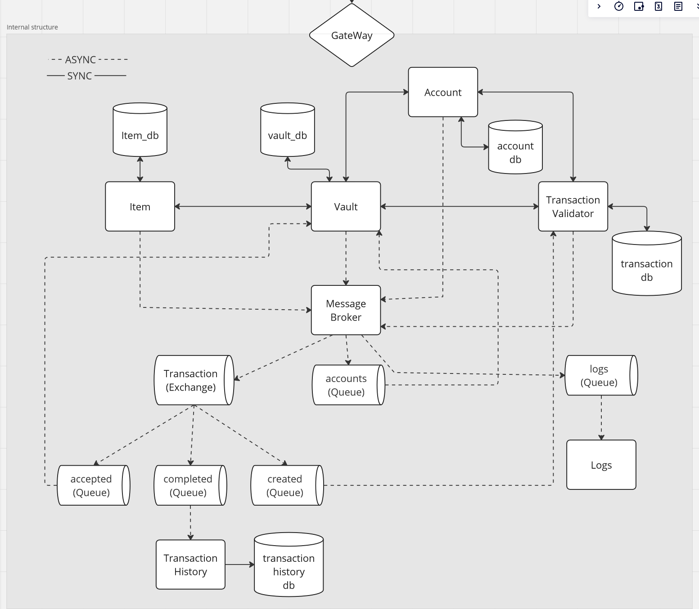

# CSGOBANK

## Commands

### MySql
* ``docker run --name vault_db -e MYSQL_ROOT_PASSWORD=Marengs -p 3306:3306 -d mysql:latest``

### Consul
* ``consul agent -node=learnmicro -dev``

### RabbitMQ
* ``docker run -it --rm --name rabbitmq -p 5672:5672 -p 15672:15672 rabbitmq:3.12-management``

### Zipkin
* ``docker run -d -p 9411:9411 openzipkin/zipkin``

### Build consul importer image
* ``docker build -t consul-importer:1.0 .``

### Push image docker hub
* Login
  * ``docker login``
* Change tag : 
  * ``docker image tag gateway:0.0.1-SNAPSHOT rikatob/gateway:0.0.1-SNAPSHOT``
* Push that image: 
  * ``docker image push rikatob/gateway:0.0.1-SNAPSHOT``

## Report

* [x] Prettify report with drawings and decisions about RabbitMQ.
* [ ] Update report with process regarding:
  * [ ] Gateway
  * [ ] Centralised logg
  * [ ] Docker
* [ ] Create a "module" diagram of our planned project structure.

## Project

* [x] Vault publisher to transaction history.
* [x] Restructure project package structure.
* [ ] Float problems with int, cant be feks 0233 that indicates 0,0233.
      Total value in vault should not be field but a method. Should it be in Vault or VaultService?

* [ ] TODO's.
  * [ ] VaultController.
  * [x] VaultService.
  * [ ] Change from layour to encoder logback. (https://logback.qos.ch/codes.html#layoutInsteadOfEncoder)
  * [ ] Use health checks to avoid that some services start before a service it is dependent on an/or spamming repuest ? 
    * https://devops.stackexchange.com/questions/12092/docker-compose-healthcheck-for-rabbitmq?newreg=614274132fbc4f92a92ba80f6d758a76
    * https://www.rabbitmq.com/monitoring.html#health-checks
  * [ ] Frontend running on own server.
## Gateway

* [x] Gateway
    * [x] Service Discovery
        * [x] Spring-cloud-starter-consul-discovery (Discovery server)
        * [x] Spring-boot-starter-actuator (Health check)
    * [x] Load Balancer.
        * [x] Spring-cloud-load-balancer
    * [x] Routing.
        * [x] Spring-cloud-starter-gateway
* [x] Centralized Configuration.
    * [x] Consul config server. ( bootstrap.yml)

## TODO
* [x] Make account, transactionhistory and vault use flyway.
* [x] Populate databases
* [x] Withdraw item
* [x] Total value in vault.
* [x] Deposit check, cant be deposit if already in vault_item_db
* [x] Total value in vault should not be static, prob not i database at all and only with getter.
* [ ] Add more logging.
* [ ] Create scratchfile with all endpoints and description.
* FRONTEND
* ACCOUNT -> VAULT -> ITEM
  * [ ] List all accounts
  * [ ] Create new account.
  * [ ] Delete account.
  * [ ] Account
    * [ ] List all vaults for account.
    * [ ] Create new vault.
    * [ ] Delete Vault.
  * [ ] Vault
      * [ ] List items.
      * [ ] Withdraw item.
      * [ ] Deposit item.
  * [ ] Item
    * [ ] Transfer item.
    * [ ] Transaction history on item.
    * [ ] Pricing history ???

* [ ] Login
### Vault
* [x] Account
    * [x] Email osv (Bruker profile)
* [x] Create new vault
* [x] Withdraw
* [x] Deposit skins
* [x] Transfer
* [x] Validate transaction
* [x] List Items (get vault items)
* [ ] Update database
* [ ] Validate item? (mulig)
* [ ] Lock
* [ ] 

### Money Buy/Sell
* [ ] Buy/Sell items
  * [ ] Item need to be sold with price
  * [x] Account based money/credit
  * [x] Transaction needs price
  * [ ] Create "offer" rabbitMQ
    * [x] Vault sends offer to RabbitMQ
    * [ ] Validator validates offer, sets "offer" to pending
    * [ ] User accepts/decline pending offers
    * [ ] validator sets offer to "validated"
    * [ ] Vault listens on rabbitMQ, validated offers happens, and sends event to history with rabbit
  * [ ] Accept "offer" rabbitMQ
### Items

* [ ] Price history

# Grading

## Required (but not sufficient) for E
* [X] Use multiple services, that fulfill different functionality and communicate with each
  other

## Required (but not sufficient) for D
* [x] At least two of the services communicate using synchronous communication (for example, direct REST calls between two services).
* [x] At least two of the services communicate using asynchronous communication (for example, using Message Queue). This will be done in accordance with event-driven architecture, as discussed in class.

## Required (but not sufficient) for C
* [x] The project uses a unique access point, that handled calls and routes them to appropriate services – Gateway
* [X] The project uses a unique access point that, in addition to routing calls, also does load balancing

## Required (but not sufficient) for B
* [X] The project has a means of centrally controlling the health of running services – health check
* [X] The project has a means of centrally controlling configurations for the services – for example, using Consul

## Required (but not sufficient) for A
* [X] The project has a means of containerization – building container images from the existing services and getting such containers running and interacting with each other

# Rapport

## Overview

CSGO is an FPS game that has a lot of items you can get with drops, unboxing, or trading.

The items don’t give you any form of advantage in the game, it is only cosmetic and like a status for having the most
“good-looking” and expensive items.
For example, an AK-47 skin is still the default AK-47 mechanically speaking, 
but the skin can make it look in a ton of different ways.
Items (skins) can be for weapons, knifes, gloves,
stickers to put on the weapons and so on.
Some skins are very rare and can have an insane price in real fiat currency (pun intended).

So, our project CSGO BANK will be a secure vault, like an inventory if you will,
to store your items and operate transactions of these items to other users. 

## Collaboration

### Responsibility
We both worked on everything more or less together, so we both had influence on what got done.
But we did divide the responsibility on the logic of services
The infrastructure (logging, tracing, gateway etc.) we both did at the same time and no clear division,
both worked on one computer most of the time.
All decisions were made with the explicit agreement from both parties

#### Major decisions
Item service should be a "faked" API from valve (Owners of the game CS:GO). 
If we had time, we would implement an API call to get real item data live.

We wanted to focus on our application itself, 
since deposit items and credits would require outside confirmation, bank transaction for credits, etc. 
we chose to implement a basic version of these that don't take any confirmation from the outside.

#### Student 2025:
Services:
 * TransactionValidator
 * TransactionHistory
 * Transaction part of vault service

The Transaction "logic"

#### Student Fredrik
Services:
 * Account
 * Item
 * Item and account part of Vault service
 * Frontend

## User stories

 * As a user I want to
   * Create an account
   * Login/Choose account
     * Create different vault
     * Choose vault
       * Deposit skins to vault.
       * Withdraw skins from vault.
       * Transfer skins between vaults.
       * Create a trade offer, either buying or selling a item
         * Accept/Decline pending offers.
   * Display vault
     * Display items
     * Display info on skins.
     * Check price of skin.
     * Display total value of vault. 
     * Click on skin to display price history.
     * Display transaction history on an item.

 